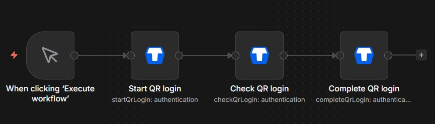
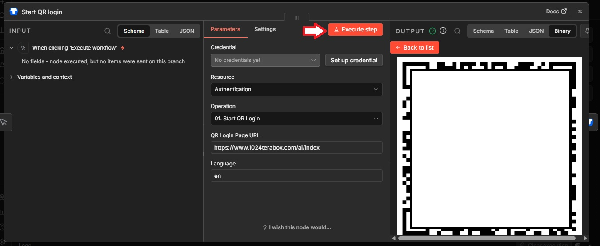
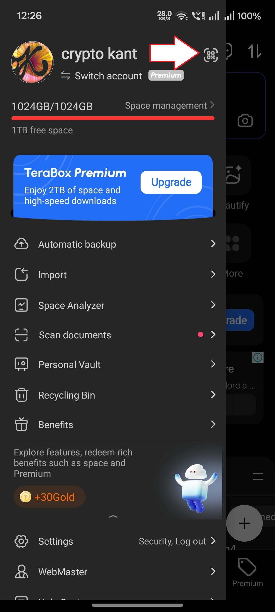
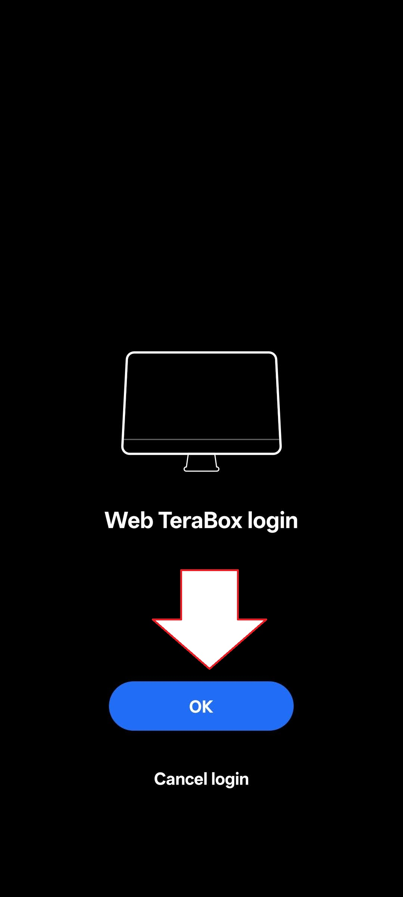
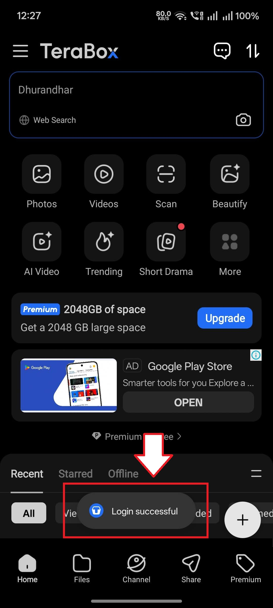
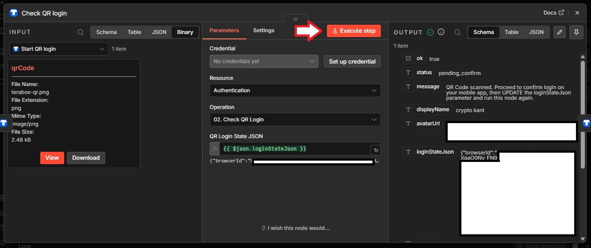
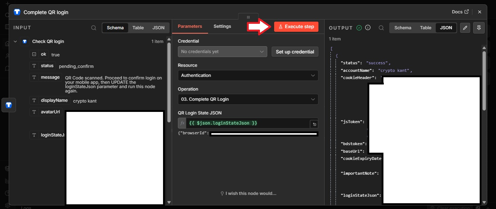

# Authorization Guide

This guide explains how to authenticate with TeraBox for use with the n8n TeraBox node.

## Overview

TeraBox does not expose a standard public developer OAuth flow for regular users. This node uses an authenticated browser session (cookies + jsToken) captured from an authenticated TeraBox web request. There are two primary methods to obtain these credentials:

1. **QR Code Login** (Recommended) - Use the built-in QR login assistant
2. **Manual Cookie Extraction** - Copy credentials from your browser's developer tools

---

## Method 1: QR Code Login (Recommended)

The QR Code Login method is the easiest and most secure way to authenticate. It uses the node's built-in operations to generate a QR code that you scan with your TeraBox mobile app.

### Step-by-Step Process

#### Step 1: Node Connection

1. Create a new workflow in n8n
2. Add a **Terabox** node
3. Set **Resource** to `Authentication`
4. Connect your TeraBox credentials (or leave empty for QR login)

---

#### Step 2: Execute Start QR Login

1. Set **Operation** to `Start QR Login`
2. Execute the node
3. The node will return a QR code image (available as binary data)
4. A `loginStateJson` object containing the session state will be returned

---

#### Step 3: Scan QR Code from TeraBox App

1. Open the TeraBox mobile app on your phone
2. Tap on the **Menu** (three dots or hamburger icon)
3. Click on **Scan** button from the menu

---

#### Step 4: Login on Mobile Screen

1. After scanning, you will see a login confirmation screen
2. Click on **Login** button on your mobile screen to confirm

---

#### Step 5: Login Success Confirmation

1. After clicking Login, you will see a success message in the TeraBox app
2. The message confirms that you have successfully logged in

---

#### Step 6: Execute Check QR Login

1. Go back to n8n
2. Add another **Terabox** node after the first one
3. Set **Resource** to `Authentication`
4. Set **Operation** to `Check QR Login`
5. Pass the `loginStateJson` from the Start QR Login output
6. Execute the node to verify the scan status

---

#### Step 7: Execute Complete QR Login

1. Add another **Terabox** node
2. Set **Resource** to `Authentication`
3. Set **Operation** to `Complete QR Login`
4. Pass the `loginStateJson` from the previous node's output
5. Execute the node

The node will return your authentication credentials:
- `cookieHeader` - The full Cookie header string
- `jsToken` - The JavaScript token
- `bdstoken` - The BDS token (for file operations)
- `baseUrl` - The API base URL

---

#### Step 8: Save Credentials

1. Copy the returned credentials from Step 7
2. Go to **n8n Settings** → **Credentials**
3. Create a new **TeraBox Session API** credential
4. Enter the values from Step 7:
   - **Cookie Header**: Paste the `cookieHeader` value
   - **JS Token**: Paste the `jsToken` value
   - **BDSToken**: Paste the `bdstoken` value (optional but recommended)
   - **Base URL**: Use default `https://dm.nephobox.com` or paste the `baseUrl` value
5. Save the credential

---

### Checking Login Status

You can use the **Check QR Login** operation to poll the login status without completing the login. This is useful for checking if a user has scanned the QR code:

1. Set **Resource** to `Authentication`
2. Set **Operation** to `Check QR Login`
3. Pass the `loginStateJson` from the Start QR Login output

The status will be one of:
- `pending` - QR code not yet scanned
- `scanned` - User has scanned but not confirmed
- `success` - Login completed successfully
- `expired` - QR code has expired

---

## Method 2: Manual Cookie Extraction

If you prefer to extract credentials manually from your browser, follow these steps:

### Step 1: Login to TeraBox

1. Open your web browser (Chrome, Firefox, Edge, etc.)
2. Navigate to [TeraBox](https://www.terabox.com) or [Nephobox](https://www.nephobox.com)
3. Log in with your TeraBox account

### Step 2: Open Developer Tools

1. Press `F12` or right-click and select **Inspect** to open Developer Tools
2. Go to the **Network** tab
3. Make sure recording is enabled (click the record button if it's gray)

### Step 3: Trigger an API Request

1. Navigate to your files in TeraBox
2. Click on a folder or perform any action that triggers an API request
3. Look for requests to `/api/list`, `/api/check/login`, or similar endpoints

### Step 4: Copy Cookie Header

1. Click on one of the API requests
2. Go to the **Headers** tab
3. Scroll down to **Request Headers**
4. Find the `Cookie` header
5. Copy the entire Cookie value

### Step 5: Copy jsToken

1. In the same request, look at the **Query String Parameters** or the request URL
2. Find the `jsToken` parameter
3. Copy its value

### Step 6: Copy bdstoken (Optional)

1. Look for the `bdstoken` parameter in the query string
2. Copy its value if present

### Step 7: Configure Credentials

1. Go to **n8n Settings** → **Credentials**
2. Create a new **TeraBox Session API** credential
3. Enter the values:
   - **Cookie Header**: The Cookie value from Step 4
   - **JS Token**: The jsToken value from Step 5
   - **BDSToken**: The bdstoken value from Step 6 (optional)
   - **Base URL**: Use default `https://dm.nephobox.com`
4. Save the credential

---

## Validating Your Credentials

After configuring your credentials, you can validate them:

1. Create a **Terabox** node
2. Set **Resource** to `Authentication`
3. Set **Operation** to `Validate Session`
4. Select your credential
5. Execute the node

The node will return:
- Login status confirmation
- Account information
- Storage quota details
- Session diagnostics

---

## Session Diagnostics

The **Session Diagnostics** operation provides detailed information about your current session:

- Cookie validity status
- Token expiration information
- Session health metrics

This is useful for troubleshooting authentication issues.

---

## Credential Fields Reference

### Cookie Header (Required)
- **Type**: Password field
- **Description**: Full Cookie request header from an authenticated TeraBox web request
- **Example**: `BAIDUID=xxx; BIDUPSID=xxx; PSTM=xxx; ...`

### JS Token (Required)
- **Type**: Password field
- **Description**: The jsToken query parameter from an authenticated request
- **Example**: `A21DBF1B7C3F4E5D6A8B9C0D1E2F3A4B`

### BDSToken (Optional)
- **Type**: Password field
- **Description**: Used by file management and share copy operations
- **Example**: `1234567890abcdef1234567890abcdef`

### Base URL (Optional)
- **Type**: String field
- **Default**: `https://dm.nephobox.com`
- **Description**: Override for the web API host if needed

---

## Security Best Practices

1. **Never share your credentials** - Keep your Cookie Header and tokens private
2. **Use environment variables** - Store sensitive values in n8n environment variables
3. **Rotate credentials regularly** - Re-authenticate periodically for security
4. **Monitor session usage** - Check session diagnostics regularly
5. **Use QR login when possible** - More secure than manual cookie extraction

---

## Common Authentication Issues

### Session Expired
- **Cause**: Cookies have expired (typically after 30 days)
- **Solution**: Re-authenticate using QR login or manual cookie extraction

### Invalid Credentials
- **Cause**: Incorrect cookie or token values
- **Solution**: Re-copy credentials carefully, ensuring no extra spaces or characters

### Token Mismatch
- **Cause**: Using cookies and tokens from different sessions
- **Solution**: Ensure all credentials are from the same authenticated session

For more troubleshooting help, see the [Troubleshooting Guide](./TROUBLESHOOTING_GUIDE.md).

---

## Next Steps

- [Operations Guide](./OPERATIONS_GUIDE.md) - Learn about all available operations
- [Troubleshooting Guide](./TROUBLESHOOTING_GUIDE.md) - Solve common issues
- [README](../README.md) - Back to main documentation